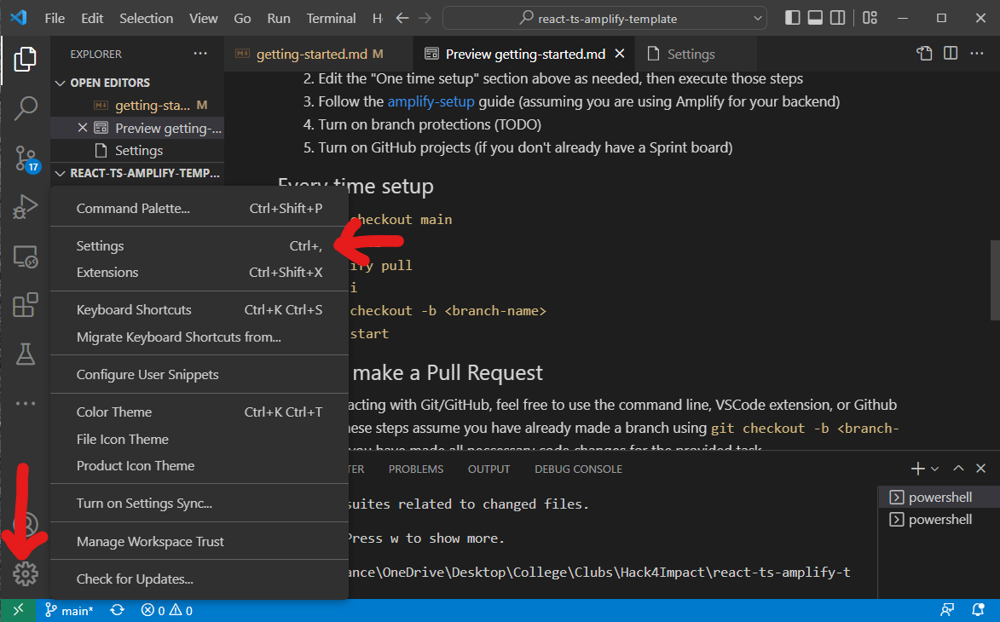
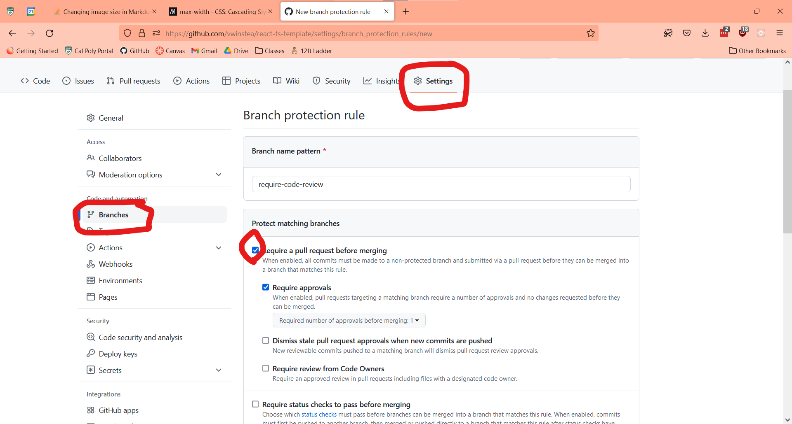

# Getting Started

Welcome to the getting started page! Here is all you need to know to get this repo up and running on your local machine, as well as good collaborative coding practices

## Contents

- [Setup for All Developers](#setup-for-all-developers)
- [Setup for Tech Leads](#setup-for-tech-leads)
- [Helpful commands](#helpful-commands)
- [Project Structure](#project-structure)

## Setup for all Developers

1. Clone this repository `git clone <repo-url>`
2. Run `npm i` at the root of the repository
3. Create a .env file and retrieve secrets from your tech lead
4. Install IDE Extensions
   - [Prettier](https://marketplace.visualstudio.com/items?itemName=esbenp.prettier-vscode)
   - [ESLint](https://marketplace.visualstudio.com/items?itemName=dbaeumer.vscode-eslint)
5. Enable format on save in your IDE
   1. Click the settings button in the bottom left  
      
   2. Search "formatter" and set your default formatter to Prettier
   3. Search "format on save" and click the checkbox
6. Familiarize yourself with [Helpful Commands](#helpful-commands), the [Project Structure](#project-structure), and the [steps for contributing](./contributing.md).

## Setup for Tech Leads

1. Set up a MongoDB cluster and create a .env with the URI
2. Edit the "One time setup" section above as needed, then execute those steps
3. Turn on branch protections for main and develop branches
   1. Visit your repo on [github.com](https://github.com)
   2. Click the Settings button on the top bar
   3. Click the branches tab on the left sidebar
   4. Click add rule
   5. Click "Require a pull request before merging"
   6. Create  
      
4. See [template-features.md](./template-features.md) for features included in this template repository.

## Helpful commands

- `npm run dev`: Start your local development environment at [http://localhost:3000](http://localhost:3000)
- `npm run lint`: make sure Prettier and ESLint pass
- `npm run lint:fix`: make sure Prettier and ESLint pass and try to automatically fix all issues (some ESLint issues must be resolved manually)
- `git stash`: Temporarily remove all local changes to a branch and save them. Good when you need to hop to another branch without committing your current code.
- `git stash apply`: Reapply most recent git stash.
- `git merge orgin/master`: Pull all changes from the main branch to yours, good for resolving merge conflicts.

## Project Structure

- [**.github**](/.github) Github Actions CI/CD and Issue/PR templates
- [**docs**](/docs) Documentation - Documentation that came with the template repository
- [**public**](/public) Assets for frontend [Read More](https://nextjs.org/docs/pages/building-your-application/optimizing/static-assets)
- [**src**](/src) All application code
  - [**app**](/src/app/) Frontend and API code
    - [**api**](/src/app/api) All API routes
    - [**components**](/src/app/components) All React components
    - [**/\***](/src/app/) App router routes for pages
    - [**styles**](/src/app/styles) All CSS files
  - [**database**](/src/database) MongoDB schemas and related files

This is a [Next.js](https://nextjs.org/) project bootstrapped with [`create-next-app`](https://github.com/vercel/next.js/tree/canary/packages/create-next-app).

## Learn More about Next.js

To learn more about Next.js, take a look at the following resources:

- [Next.js Documentation](https://nextjs.org/docs) - learn about Next.js features and API.
- [Learn Next.js](https://nextjs.org/learn) - an interactive Next.js tutorial.
- [NextAuth Documentation](https://next-auth.js.org/) - learn about authentication and authorization with NextAuth

You can check out [the Next.js GitHub repository](https://github.com/vercel/next.js/) - your feedback and contributions are welcome!
